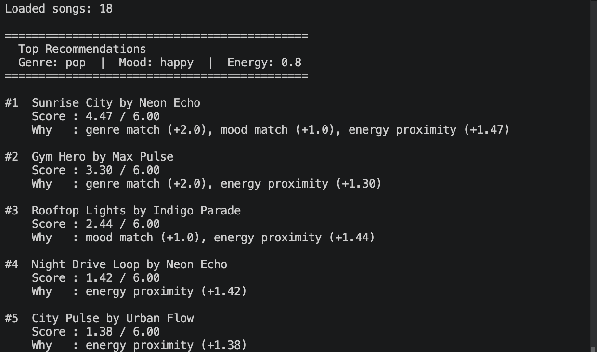
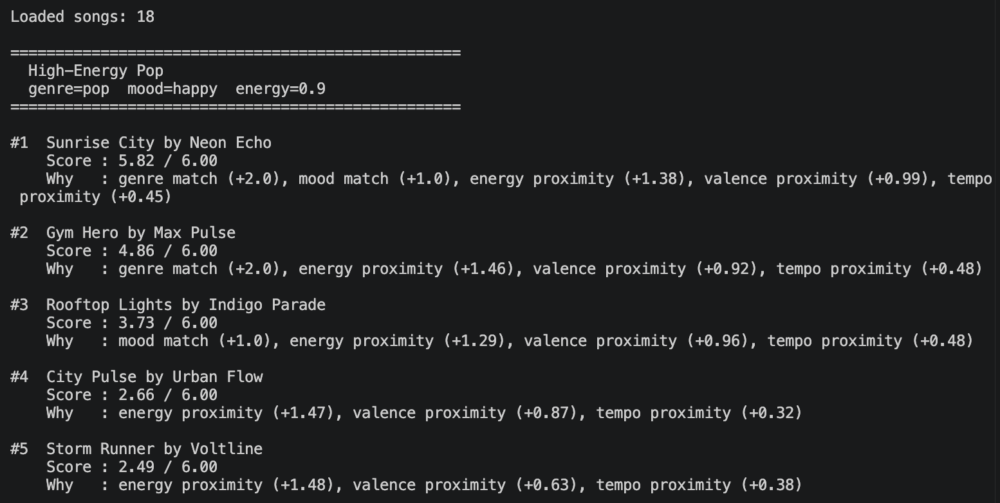
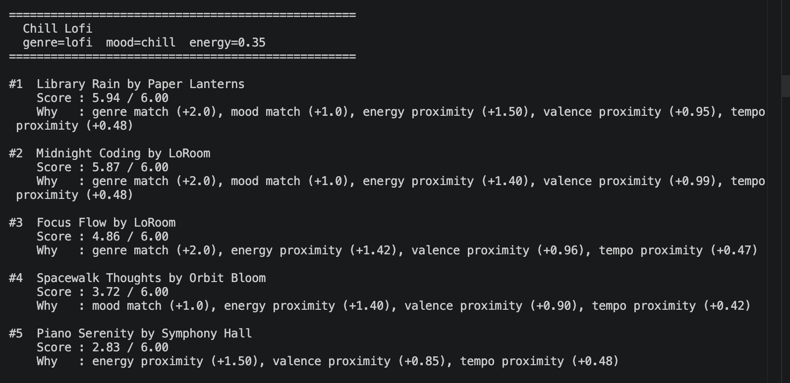
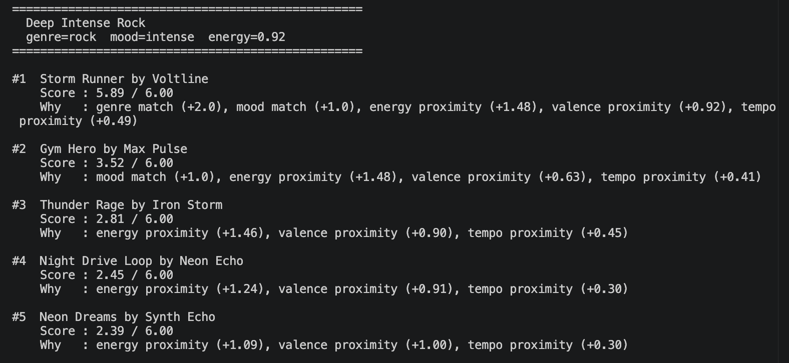
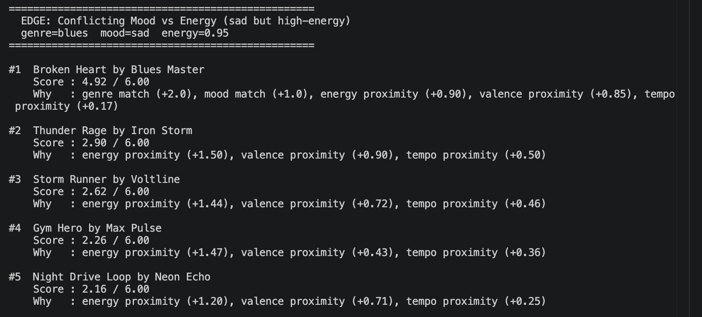
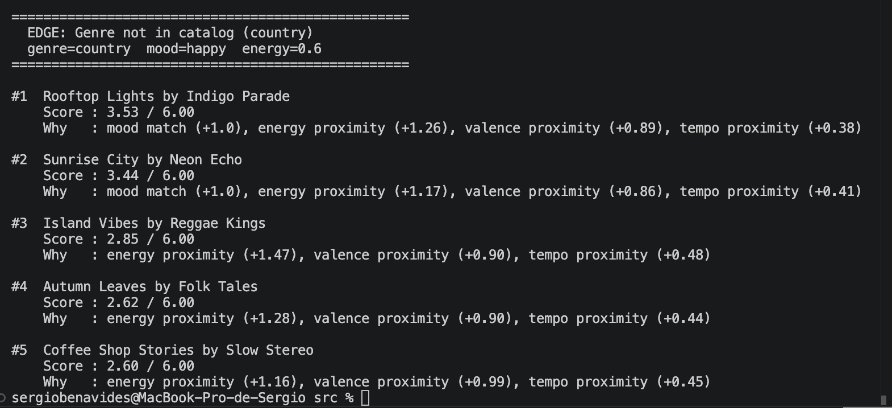

# 🎵 Music Recommender Simulation

## Project Summary

SoundMatch 1.0 is a simple music recommender that suggests songs based on a user's preferred genre, mood, and energy level. It scores every song in a catalog of 18 tracks and returns the top matches with a short reason for each pick. The system was built and tested in Python as a CLI tool.

---

## How The System Works

Big platforms like Spotify combine collaborative filtering, which is based on what users like, and content-based filtering which takes attributes from the song to make recommendations. 
This recommender will prioritize content-based filtering. It analyzes features like genre, mood, energy, and tempo, then scores new songs by how closely they match the user's taste. The system ranks songs by their computed scores to surface the best matches first.

### Song Features
- `id`
- `title`
- `artist`
- `genre`
- `mood`
- `energy`
- `tempo_bpm`
- `valence`
- `danceability`
- `acousticness`

### UserProfile Features
- `preferred_genre`
- `preferred_mood`
- `target_energy`
- `target_valence`
- `target_tempo_bpm`

### Scoring & Ranking

Every song in the catalog is evaluated against the user profile and given a score. Songs are sorted by score (highest first) and the top K are returned as recommendations.

#### Algorithm Recipe

| Signal | Points | How It's Calculated |
|---|---|---|
| Genre match | **+2.0** | Exact match between `song.genre` and `preferred_genre` |
| Mood match | **+1.0** | Exact match between `song.mood` and `preferred_mood` |
| Energy proximity | **up to +1.5** | `1.5 × (1 − |song.energy − target_energy|)` |
| Valence proximity | **up to +1.0** | `1.0 × (1 − |song.valence − target_valence|)` |
| Tempo proximity | **up to +0.5** | `0.5 × (1 − |song.tempo_bpm − target_tempo_bpm| / 100)` |

**Maximum possible score: 6.0**

#### Terminal Output



**Profile 1 — High-Energy Pop**


**Profile 2 — Chill Lofi**


**Profile 3 — Deep Intense Rock**


**Profile 4 — Edge Case: Sad but High-Energy**


**Profile 5 — Edge Case: Genre Not in Catalog (Country)**


#### Potential Biases

- **Genre over-dominance:** Because genre is worth +2.0, the system might skip a song that perfectly matches the user's mood and energy just because it belongs to a slightly different genre.
- **Mood labels are rigid:** "Chill" and "relaxed" feel similar, but the system scores them as completely different — a zero-point mood match.
- **No variety:** The system always picks the closest matches. If several songs share the same genre and mood, the top results may feel repetitive.

---

## Getting Started

### Setup

1. Create a virtual environment (optional but recommended):

   ```bash
   python -m venv .venv
   source .venv/bin/activate      # Mac or Linux
   .venv\Scripts\activate         # Windows

2. Install dependencies

```bash
pip install -r requirements.txt
```

3. Run the app:

```bash
python -m src.main
```

### Running Tests

Run the starter tests with:

```bash
pytest
```

You can add more tests in `tests/test_recommender.py`.

---

## Experiments You Tried

- Tested 5 profiles: High-Energy Pop, Chill Lofi, Deep Intense Rock, and two edge cases.
- Halved the genre weight and doubled the energy weight — the top picks stayed the same but scores got closer together.
- Found that if a genre is missing from the catalog, the system returns unrelated songs with no warning.

---

## Limitations and Risks

- Only 18 songs in the catalog — results are limited by data size.
- Genre and mood must be typed exactly — a synonym like "mellow" instead of "chill" scores zero.
- Pop and lofi users get better results because those genres have more songs.

---

## Reflection

[**Model Card**](model_card.md)

This project showed me that a recommender is just math — it adds up points and picks the highest score. The surprising part was how "smart" it felt even though the logic is simple. The hardest lesson was that bad data causes bad results no matter how good the code is.

---